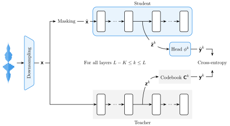

# SpidR: Learning Fast and Stable Linguistic Units for Spoken Language Models Without Supervision

This repository contains the training code and model checkpoints from: https://arxiv.org.

## Overview



SpidR is a self-supervised speech representation model that efficiently learns strong
representations for spoken language modeling.
It is trained on unlabelled speech using a masked prediction objective combined with
self-distillation and online clustering. The intermediate layers of the student model
learn to predict assignments derived from the teacher intermediate layers.
This learning objective stabilizes the online clustering procedure compared to
previous approaches, resulting in higher-quality codebooks. SpidR outperforms previous
state-of-the-art methods on downstream language modeling metrics.

With this codebase you can pretrain SpidR for 400k steps in only a day on 16 A100,
and in 15 hours on 16 H100. We distribute two checkpoints: SpidR and DinoSR pretrained
with this codebase on LibriSpeech.

## Installation

This is available as a package on PyPI.
To use the pretrained models, the only dependencies are `torch>=2.7.1` and `numpy>=1.26.4`, with Python 3.12 at least.
If you want to train your own model, install the optional `train` dependencies.

For inference:
```
pip install spidr
```

For training:
```
pip install spidr[train]
```

Or if you want to tinker with this repository, clone it and create a virtual environment with uv:
```
git clone https://github.com/facebookresearch/spidr
cd spidr
uv sync --extra train
```

You need the optional dependencies to import `spidr.data`, `spidr.slurm`, `spidr.train`,
`spidr.validate`, and to run the scripts in `paper/`.

## Usage

### Using a pretrained model

We distribute two models used in our paper: [`spidr-base`]() and [`dinosr-base`]().
Both are pretrained on LibriSpeech 960h.
You can load one of those models like this:

```python
from spidr.models import load_pretrained

model = load_pretrained("spidr-base").to("cuda")
```

This function can also be used to load the [original DinoSR checkpoint](https://github.com/Alexander-H-Liu/dinosr)
with `model = load_pretrained("dinosr-original")`.

The forward function of SpidR and DinoSR returns the loss and the perplexities.
To get intermediate representations use the `get_intermediate_outputs` method, or the `get_codebooks` method
if you prefer to extract the codebook predictions from the student model.

See `paper/extract_features.py` for an example of how to use the pretrained models.

> [!WARNING]
> The models have been trained with standardized audio (mean of 0 and variance of 1).
> The standardization is not done inside the model.
> Either do it yourself, or use the function `spidr.data.speech_dataset` with `normalize=True` to create your dataset.

### Launching training runs

#### Manifest files

First, create a manifest file that contains the paths to the audio files and the number of samples (either CSV file or TSV like in fairseq).
We support loading audio files from an uncompressed tar archive.
Use `spidr.data.write_manifest` to easily create it:

```bash
❯ python -m spidr.data.write_manifest --help
usage: write_manifest.py [-h] [--ext EXT] [--fairseq] dataset output

Write manifest files.

positional arguments:
  dataset     Path to the dataset directory or uncompressed tar file.
  output      Path to the output manifest file.

options:
  -h, --help  show this help message and exit
  --ext EXT   Extension of audio files. (default: .wav)
  --fairseq   Write a Fairseq-style TSV manifest, instead of CSV.
```

#### Configuration

Create a TOML configuration file for the training run. This will be used to create an instance of `spidr.config.Config`.
Check out `src/spidr/config.py` to see the available fields.
You can start from `configs/example.toml` (it only specifies the required fields).

#### Training

We provide utilities to launch jobs on a SLURM cluster.
The training run is in one job, and the validation is launched in separate jobs to not interrupt training.
You can launch a training run from your terminal:

```bash
❯ python -m spidr --help
usage: __main__.py [-h] -A ACCOUNT -N NODES -G GPUS_PER_NODE [-c CPUS_PER_TASK] [--mem-per-gpu MEM_PER_GPU] [-t TIME]
                   [-C CONSTRAINT] [-q QOS] [--dump DUMP]
                   configs [configs ...]

Launch training runs.

positional arguments:
  configs               TOML config file(s) for the training run(s).

options:
  -h, --help            show this help message and exit
  -A ACCOUNT, --account ACCOUNT
                        SLURM account (default: None)
  -N NODES, --nodes NODES
                        Number of nodes (default: None)
  -G GPUS_PER_NODE, --gpus-per-node GPUS_PER_NODE
                        GPUs per node (default: None)
  -c CPUS_PER_TASK, --cpus-per-task CPUS_PER_TASK
                        CPUs per task (default: None)
  --mem-per-gpu MEM_PER_GPU
                        Memory per GPU (default: None)
  -t TIME, --time TIME  Time limit in minutes (default: None)
  -C CONSTRAINT, --constraint CONSTRAINT
                        SLURM constraint (default: None)
  -q QOS, --qos QOS     SLURM qos (default: None)
  --dump DUMP           Submitit dump (default: None)
```

By default we use torch.compile, the first batches will be quite slow to process.
To speed up training, you can also remove the computation of the perplexities in the
source code if you do not care about it.

## License

The source code and model checkpoints are provided under the MIT License.

## Citation

```bibtex
@misc{

}
```